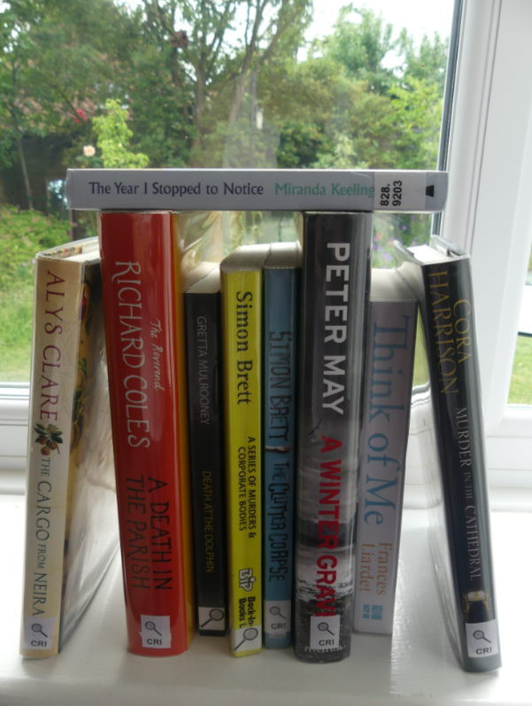

  
  

# Rate my bookshelf backend

## About

This repository hosts the backend code for the Rate My Bookshelf ([try it here](https://rate-my-bookshelf.vercel.app/)) app.

The repository contains processing capabilties under `app/services/` whilst `app/api/` contains endpoints for the webapp to call.

There is a Dockerfile which helps to containerise the code, and for the app it is being hosted on Google Cloud Run.

There is also a notebook image_processing.ipynb which demonstrates how the segmentation algorithm works - this is a custom tree-based algorithm that uses edge detection to segment the image into orthogonal rectangles.

## How to use

For developers, install poetry and then run `poetry install` and then

`poetry run uvicorn app.main:app --host 0.0.0.0 --port 8080`

to run the current version locally.

To containerise, run:

`docker build -t bookshelf-backend .`

`docker run -e GEMINI_API_KEY=123 -p 8080:8080 bookshelf-backend`

To upload the container to the cloud:

`docker tag bookshelf-backend:latest europe-west1-docker.pkg.dev/<project-id>/docker-repo/bookshelf-backend:latest`

`docker push europe-west1-docker.pkg.dev/<project-id>/docker-repo/bookshelf-backend:latest`